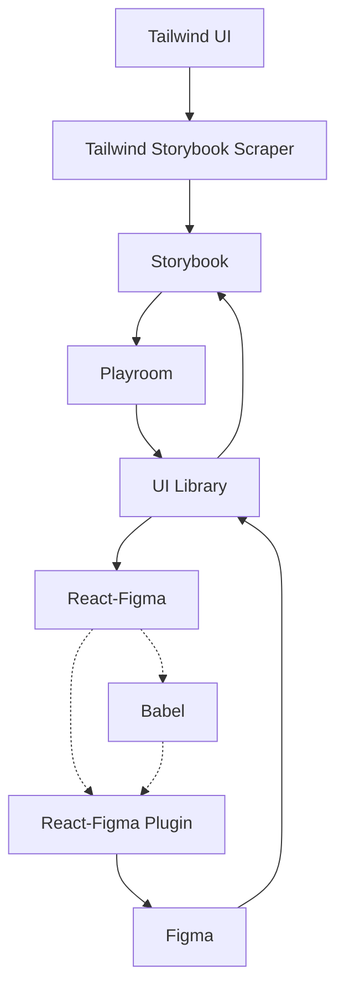

# FTR

`Figma` <-> `Tailwind` & `React` interoperability

## Workflow

```mermaid
graph TD
	Tail["Tailwind UI"] --> TailScrape["Tailwind Storybook Scraper"]
	TailScrape --> Storybook
	UI["UI Library"] --> Storybook
	Storybook --> Playroom
	Playroom --> UI
	UI --> ReactFigma["React-Figma"]
	ReactFigma -.-> ReactFigmaPlugin["React-Figma Plugin"] 
  ReactFigma -.-> Babel
  Babel -.->ReactFigmaPlugin
	ReactFigmaPlugin --> Figma
	Figma --> UI
```

