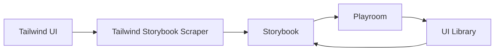
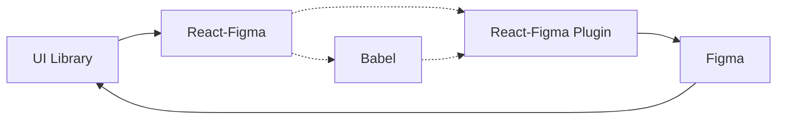
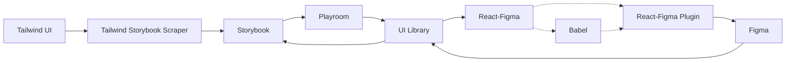

# FTR

`Figma` <-> `Tailwind` & `React` interoperability

## Current Landscape
There are multiple projects that convert Figma into React (eg. [Anima](https://www.animaapp.com/blog/design-to-code/how-to-export-figma-to-react/), [FireJet](https://firejet.io/)). These are fairly robust/readable and make it easy for developers to go from design to code. 

## Pain Points
- No FOSS solution
- Conversion isn't bi-directional

## Why `FTR`
At Capswan, want to go from our UI library to Figma. Reasons for doing this:
- minimize pixel-perfect incongruencies between design & development
- mitigate design/development time to keep figma files & react library in sync UI & design libraries
  - automate on build
- make it faster to go from idea to production
  - allow product managers to quickly play around with component libraries in figma or playroom
  - allow designers to use components that devs made on the fly which might not be in their initial designs
  - allow developers to utilize components in apps without needing to manually code

## Workflows

### Current Workflow

### Augmented Workflow

### Complete Workflow

## Dependencies
- [react-figma](https://react-figma.dev/)
> Render React in figma 
- [babel](https://babeljs.io/)
> Convert ReactDOM (ie. UI library components) to React-Figma syntax
> eg. `
` => `<Text>`

## References
- [figma-to-react](https://github.com/kazuyaseki/figma-to-react)
- [figma-react-experiments](https://brikerr.github.io/figma-react-experiments/)
- [firejet](https://firejet.io/)
- [anima](https://www.animaapp.com/)
