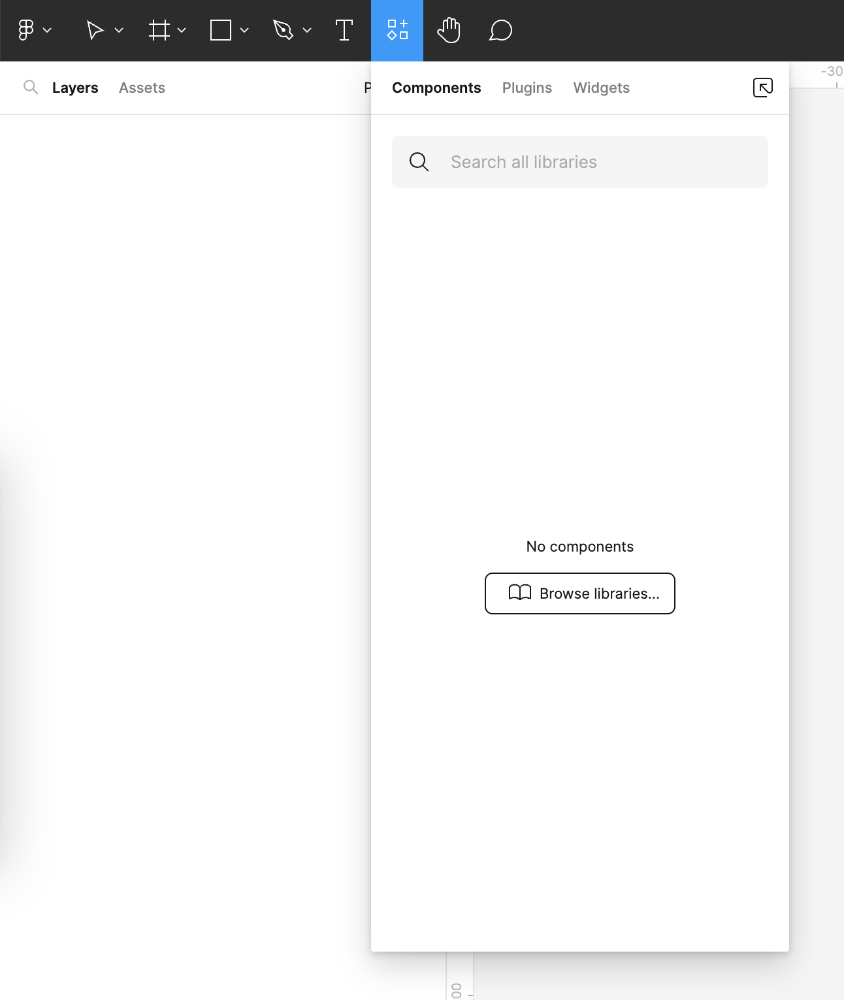
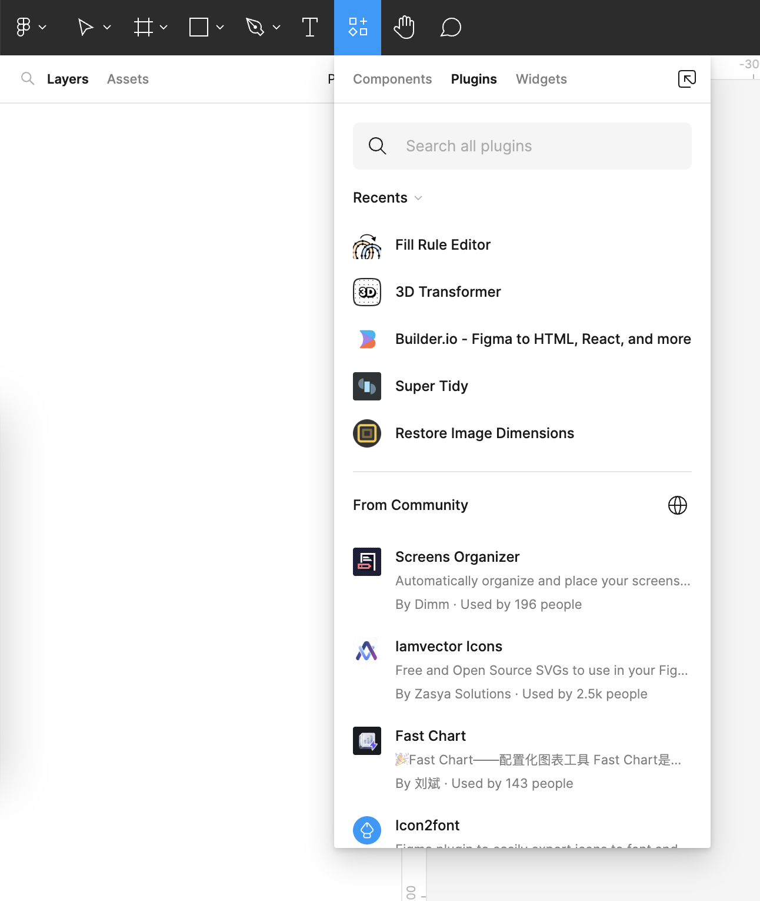
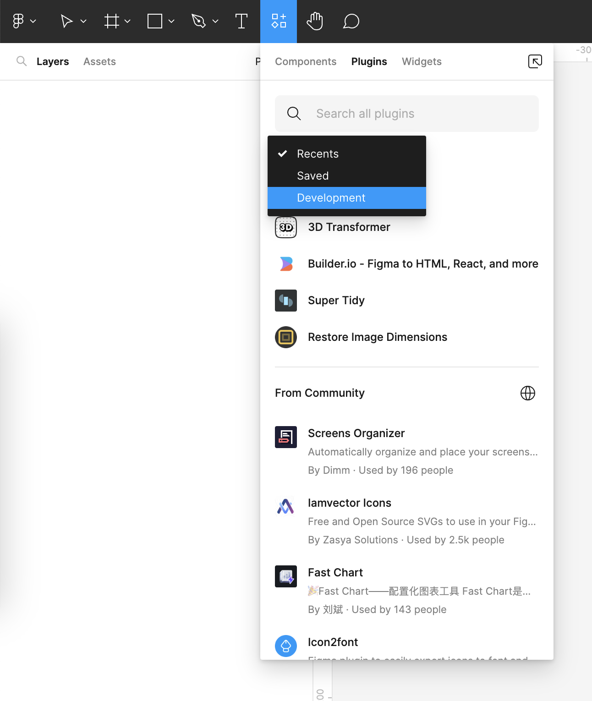
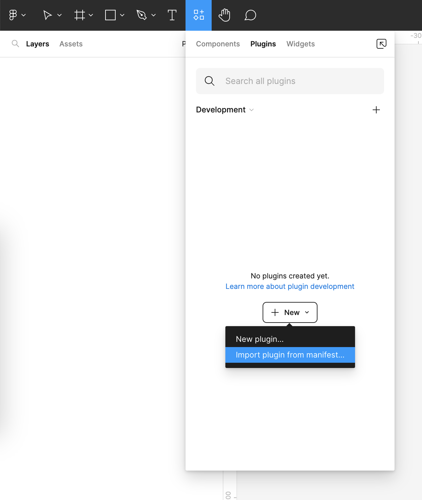
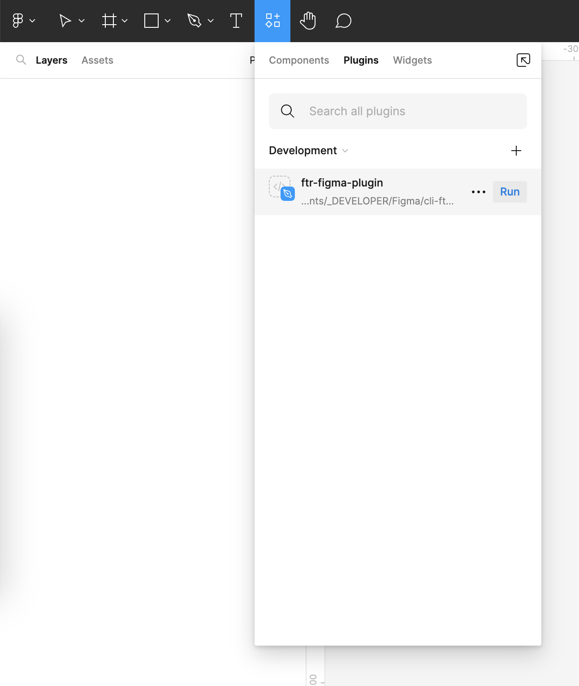
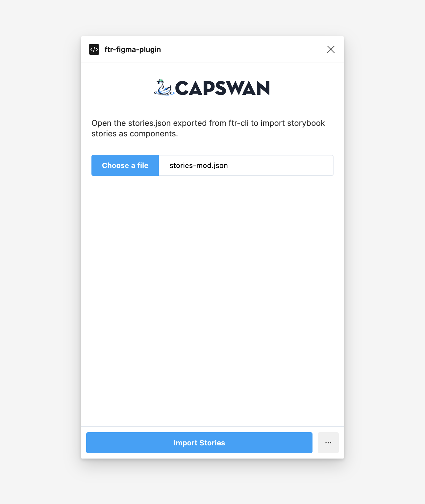
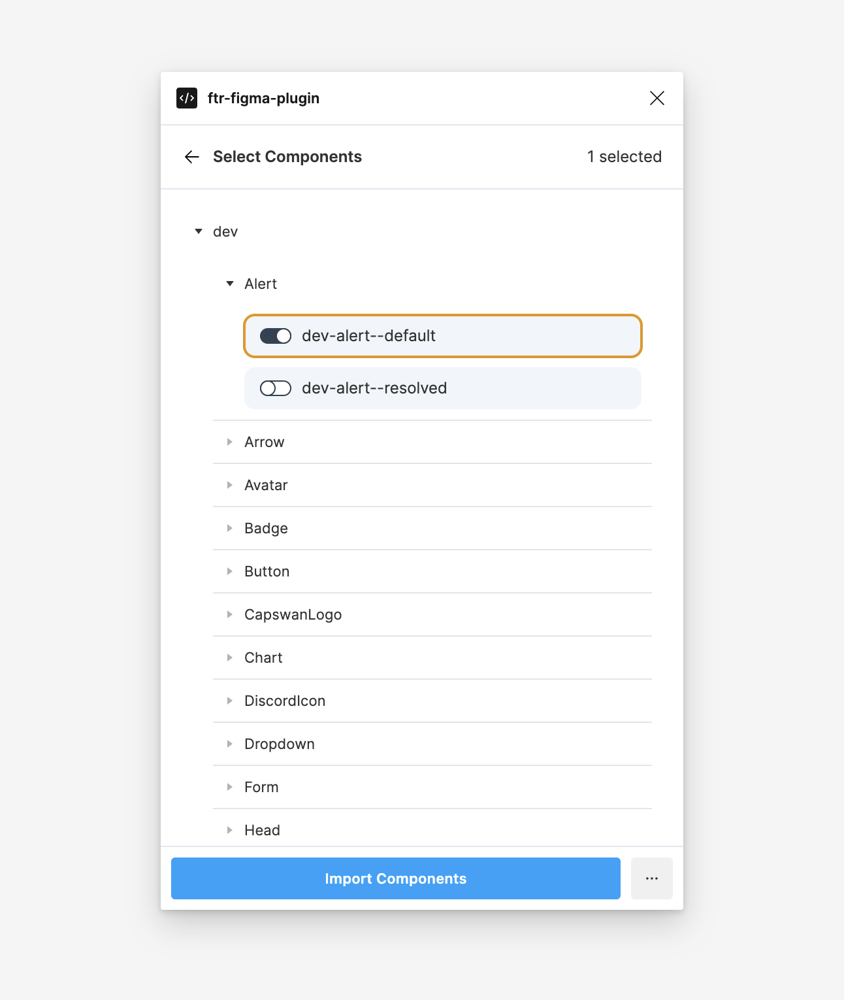

# ftr-figma-plugin

`Figma` <-> `Tailwind` + `React`

Runs a development Figma plugin that allows you to open a json file with exported storybook stories (see `ftr-cli`). The stories can then be imported as Figma components.

---

## Warning:

FTR in its current state is highly experimental. Please don't use the figma plugin with your production files as artboards might get deleted or changed. We recommend using an empty figma file to test this out.

---

## Description

This plugin uses the json file that was exported using `ftr-cli` and allows you to select stories to import as Figma components. Under the hood this plugin uses [react-figma](https://github.com/react-figma/react-figma), which renders Figma components through jsx.

## Getting Started

1. Clone this repository: `git clone https://github.com/Capswan/cli-ftr`
2. Navigate to the Figma plugin folder: `cd ftr-figma-plugin`
3. Install dependencies: `yarn` or `npm i`

### Dependencies

- [Node](https://nodejs.org/en/) is installed on your system
- (Optional) [yarn](https://yarnpkg.com/) is installed on your system
- You have a [storybook](https://storybook.js.org/) instance running somewhere that you will scrape.
- Your storybook should be using [Tailwind](https://tailwindcss.com/) classes for 99.99% of all styling.

### Running ftr-figma-plugin

1. `npm run webpack:watch` or `yarn webpack:watch`
2. Open a blank file in Figma  
3. Open the `Components/Plugins/Widgets` view:  

4. Switch to the `Plugins` tab:  

5. Change the `Recents` select box to `Development`:  

6. Click the `New` button and select `Import plugin from manifest`:  

7. Navigate to this folder and select the `manifest.json`  
8. Click the `Run` button:  

9. Click the `Choose a file` button and open the stories export from `ftr-cli` (or the demo file from the `demo` folder) and click `Import Stories`:  

10. Select the stories you want to import as Components and click `Import Components`:  


## Help

🤷‍♂️ Get in touch, open an issue. We'll figure something out.

## Authors

[Shremp](till@eightdaysaweek.cc)

## Version History

- 0.0.1
  - Initial Release

## License

This project is licensed under the MIT License - see the LICENSE file for details

## Acknowledgments

- [React-Figma](https://react-figma.dev/)

## Alternatives

- [story.to.design](https://story.to.design/)

---

## react-figma boilerplate

A basic template to start working with [react-figma](https://www.npmjs.com/package/react-figma) package

The template includes:

- Basic file structure
- TypeScript configuration
- Webpack configuration

## Quick start

- clone repository from GitHub

  ```
  git clone https://github.com/react-figma/react-figma-boilerplate.git <your project name>
  ```

- install node modules either with `Yarn` or `npm`

  Yarn:

  ```
  cd <your project name>
  yarn
  ```

  npm:

  ```
  cd <your project name>
  npm install
  ```

- run

  Yarn:

  ```
  yarn webpack:watch
  ```

  npm:

  ```
  cd <your project name>
  npm run webpack:watch
  ```

- hot reload

  ```
  brew install modd
  ```

  Then to tell modd what to watch, add modd.conf to your project:

  ```
  ** !dist/** !lib/** !node_modules/** {
      prep: yarn build
      prep: ./applescript.sh
  }
  ```

  The first line is a file matching pattern which says "Hey modd, watch all file except files under dist, lib and node_modules". When modd detects a change, it executes each of the prep command in sequence. The first one runs webpack which bundles our plugin UI js. The second is a shell script which contains an apple script which tells OS X to bring the Figma desktop app to the foreground i.e. activate it and sends it the command + option + p shortcut which tells Figma to re-run the last plugin. There are 2 caveats with the apple script:

  You need to use OS X and give the terminal app security access to accessibility.
  You'll need to run your plugin manually once first otherwise the command+option+p shortcut doesn't have anything to re-run.
  To run modd, just type modd in the terminal. I aliased this as yarn build in my project.

## Export Stories

Go to your storybook project.
Make sure you have built your storybook to `storybook-static` already, or do so.
Then, run:

```
npx -p @storybook/cli@next sb extract
```

This command extracts a stories.json
